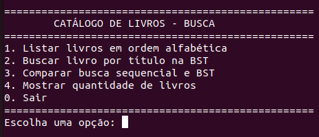
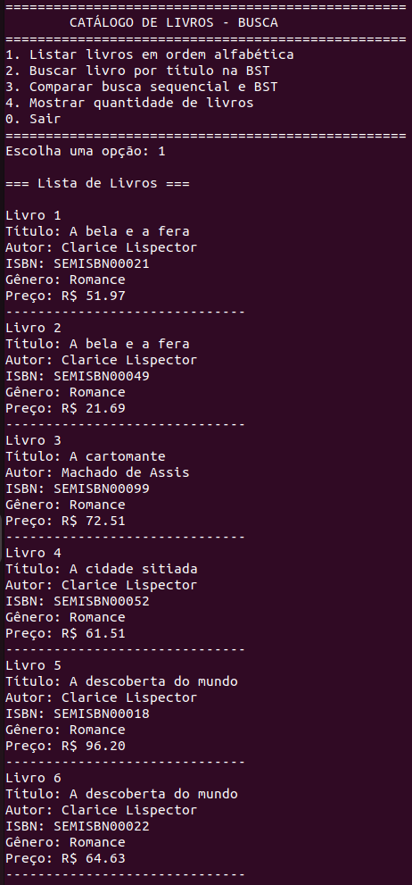
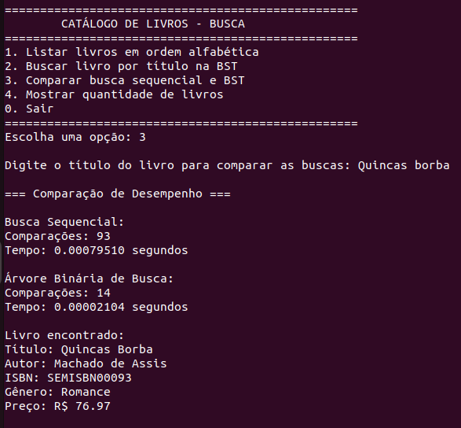
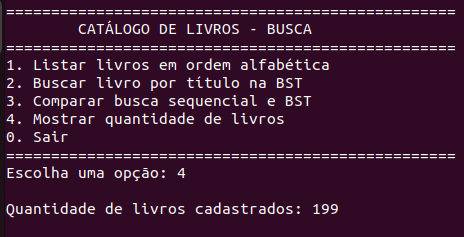

# G28-Busca-EDA2-26.1

# Catálogo de Livros de Autores Brasileiros

Conteúdo da Disciplina: Algoritmos de Busca<br>
Grupo: 28<br>

Vídeo da Apresentação: [link](https://youtu.be/jQt5LYf2fsU)

## Alunos
| Matrícula | Aluno |
| -- | -- |
| 231026840 | Laryssa Felix Ribeiro Lopes|
| 231035731 | Mayara Marques Silva |

---

## Sobre 
Este projeto tem como objetivo implementar e comparar algoritmos de busca em um sistema de catálogo de livros.

O sistema permite o cadastro e a busca de livros utilizando duas abordagens:
- **Árvore Binária de Busca (BST)** como método principal
- **Busca Sequencial** como método de comparação

Os livros são organizados com base no título, permitindo buscas eficientes e listagem ordenada.

Além disso, o projeto utiliza:

## Base de Dados

O projeto utiliza uma base de dados construída a partir da API da  
:contentReference[oaicite:0]{index=0}.

---

### Processo de geração dos dados:

1. Coleta de livros reais via API
2. Conversão para formato estruturado (`JSON`)
3. Limpeza dos dados:
   - remoção de títulos com caracteres inválidos
   - remoção de idiomas não desejados
   - filtragem de padrões inconsistentes
4. Armazenamento local no arquivo:

```
livros_limpos.json

```
---

## Screenshots

Prints do sistema rodando

### - Menu do sistema:



1. Listar livros
Mostra todos os livros em ordem alfabética usando a BST (percurso em ordem).
OBS: Se dois livros tiverem o mesmo título, a ordenação é feita pelo ISBN

2. Buscar livro na BST
Busca um livro pelo título de forma eficiente (mais rápida que a sequencial).

3. Comparar buscas
Compara:

      busca sequencial (O(n)) <BR>
      busca na BST (O(log n), em média) <BR>
      Mostra número de comparações e tempo.

4. Quantidade de livros
Exibe o total de livros cadastrados.

0. Sair
Encerra o programa.

### -  Busca do livro usando Árvore Binária de Busca (BST)



### - Comparar busca sequencial e BST



Comparações

Indicam quantas verificações o algoritmo fez até encontrar o livro.

- Busca Sequencial:
Compara um a um
93 comparações (percorreu quase toda a lista)
- BST:
Usa a estrutura da árvore para reduzir buscas
14 comparações (mais eficiente)

Tempo

Tempo total para executar a busca.

- Busca Sequencial: 0.00079510 s
- BST: 0.00002104 s

### - Quantidade de livros


---

## Instalação 

**Linguagem:** Python 3.10+<br>

### Pré-requisitos:
- Python 3 instalado
- pip instalado

### Passos:

Clone o repositório:
```bash
git clone https://github.com/eda2-2026/G28-Busca-EDA2-26.1.git
cd G28-Busca-EDA2-26.1
```

Instale as dependências:

```
pip install -r requirements.txt
```

### Como executar o projeto

1. Executar o sistema
```
python3 main.py
```
---

## Estrutura do Projeto

```bash
G28-Busca-EDA2-26.1/
├── arvore.py               # Implementação da BST
├── busca_sequencial.py     # Busca sequencial
├── dados.py                # Leitura do JSON
├── gerar_base.py           # Geração da base via API
├── limpar_base.py          # Limpeza dos dados
├── livro.py                # Classe Livro
├── livros.json             # Base de dados local
├── main.py                 # Execução do sistema
├── no.py                   # Estrutura do nó da árvore
├── utils.py                # Funções auxiliares
├── requirements.txt        # Dependências
└── README.md
